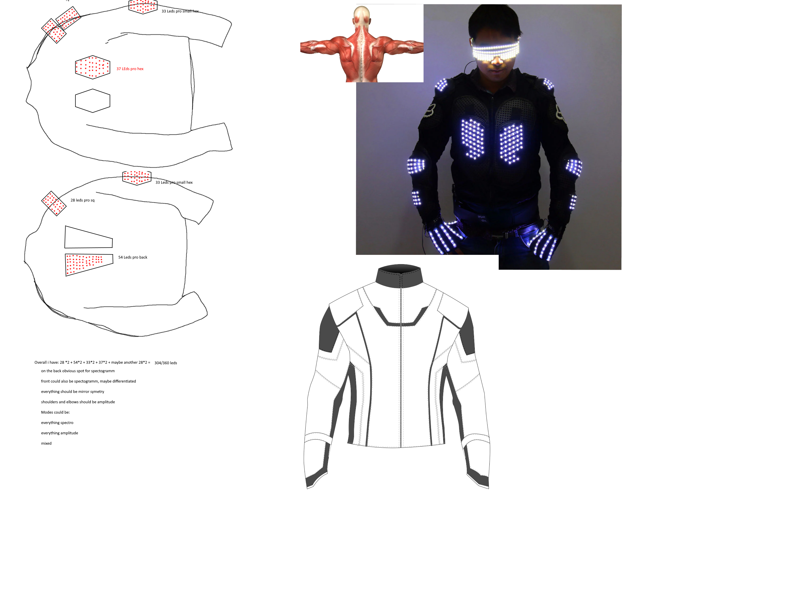

# This is a Repo for my LED suit Project

The main idea is to create a LED suit which is wearable and able to react to music dynmically. This is implemented using a Raspberry Pi 3, LEDS strips and an Omnidirectional Mikrophone.

## Visual Overview

## By Philip Kenneweg
